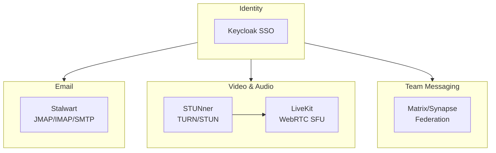

# OpenOva Relay

Enterprise communication platform with email, video, chat, and WebRTC.

**Status:** Accepted | **Updated:** 2026-02-26

---

## Overview

OpenOva Relay bundles self-hosted communication components into a unified enterprise communication product. It provides email, real-time video/audio, team messaging, and WebRTC infrastructure.



---

## Components

All components are in `platform/` (flat structure):

| Component | Purpose | Location |
|-----------|---------|----------|
| [stalwart](../../platform/stalwart/) | Email server (JMAP/IMAP/SMTP) | platform/stalwart |
| [livekit](../../platform/livekit/) | Video/audio/data (WebRTC SFU) | platform/livekit |
| [stunner](../../platform/stunner/) | Kubernetes-native TURN/STUN | platform/stunner |
| [matrix](../../platform/matrix/) | Team chat (Matrix/Synapse) | platform/matrix |

### Optional Dependencies

| Component | Purpose |
|-----------|---------|
| Keycloak | SSO across all communication services |
| CNPG | PostgreSQL backend for Matrix and Stalwart |
| SeaweedFS | Recording and attachment storage |

---

## Use Cases

### Enterprise Email

Self-hosted email with JMAP/IMAP/SMTP, spam filtering, and compliance archiving.

### Video Conferencing

WebRTC-based video calls, screen sharing, and recording with Kubernetes-native TURN/STUN.

### Team Messaging

End-to-end encrypted team chat with federation support, bridges (Slack, IRC), and webhook integrations.

---

## Resource Requirements

| Component | Replicas | CPU | Memory |
|-----------|----------|-----|--------|
| Stalwart | 2 | 1 | 2Gi |
| LiveKit | 2 | 2 | 4Gi |
| STUNner | 2 | 0.5 | 512Mi |
| Matrix/Synapse | 2 | 1 | 2Gi |
| **Total** | - | **9** | **17Gi** |

---

## Deployment

```yaml
apiVersion: kustomize.toolkit.fluxcd.io/v1
kind: Kustomization
metadata:
  name: relay
  namespace: flux-system
spec:
  interval: 10m
  path: ./products/relay/deploy
  prune: true
  sourceRef:
    kind: GitRepository
    name: openova-blueprints
```

---

*Part of [OpenOva](https://openova.io)*
