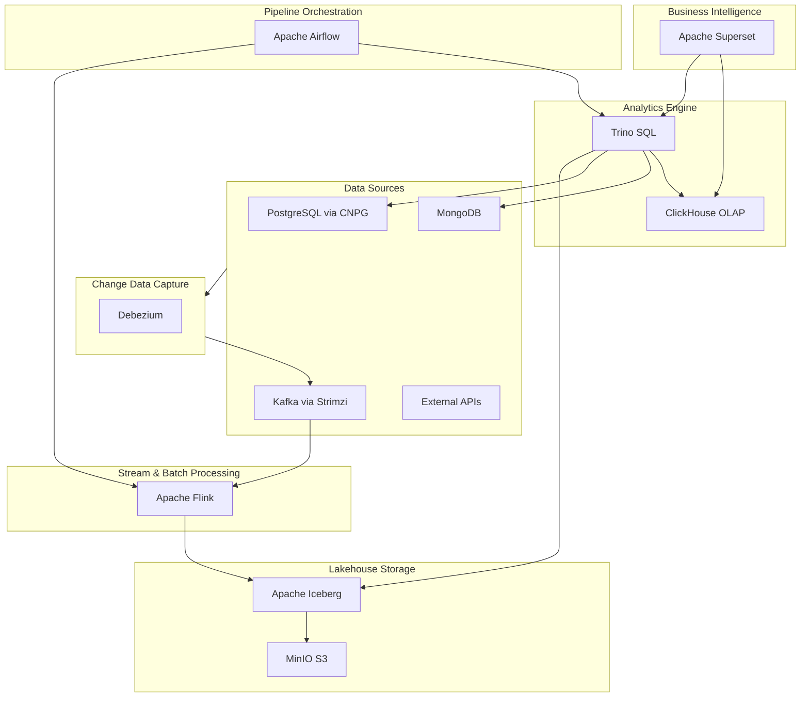

# OpenOva Titan

Enterprise data lakehouse platform for massive-scale analytics.

**Status:** Accepted | **Updated:** 2026-02-09

---

## Overview

OpenOva Titan is the heavy lifter of the OpenOva product family. It provides a complete data lakehouse platform that processes, stores, queries, and visualizes data at massive scale - all on Kubernetes.

Titan replaces expensive proprietary analytics stacks (Snowflake, Databricks, Tableau) with a curated open-source alternative that runs on your infrastructure with no vendor lock-in.

## Architecture

## Components

| Component | Purpose | Location |
|-----------|---------|----------|
| [iceberg](../../platform/iceberg/) | Open table format (ACID, schema evolution) | platform/iceberg |
| [trino](../../platform/trino/) | Distributed SQL query engine | platform/trino |
| [superset](../../platform/superset/) | BI visualization & dashboards | platform/superset |
| [flink](../../platform/flink/) | Stream + batch data processing | platform/flink |
| [airflow](../../platform/airflow/) | Pipeline orchestration | platform/airflow |
| [clickhouse](../../platform/clickhouse/) | OLAP analytical database | platform/clickhouse |
| [debezium](../../platform/debezium/) | Change data capture | platform/debezium |

Also leverages core platform: MinIO (storage), Strimzi/Kafka (streaming), CNPG (metadata), Grafana (monitoring).

## Use Cases

| Use Case | Components | Description |
|----------|-----------|-------------|
| Real-time analytics | Kafka → Flink → ClickHouse → Superset | Stream processing with instant visualization |
| Data lakehouse | Debezium → Kafka → Flink → Iceberg → Trino | CDC into lakehouse with SQL query access |
| Federated queries | Trino → (PostgreSQL + MongoDB + Iceberg) | Single SQL interface across all data sources |
| BI & reporting | Trino/ClickHouse → Superset | Business dashboards replacing Tableau/Power BI |
| ETL pipelines | Airflow → Flink → Iceberg | Orchestrated batch processing |

## Consequences

**Positive:**
- Complete data lakehouse on Kubernetes
- Replaces Snowflake/Databricks/Tableau
- All Apache 2.0 licensed
- Runs on customer infrastructure (no cloud lock-in)
- Federated queries across all data sources

**Negative:**
- Resource-intensive (CPU + memory for analytics)
- Requires data engineering expertise
- Complex multi-component deployment

---

*Part of [OpenOva](https://openova.io)*
